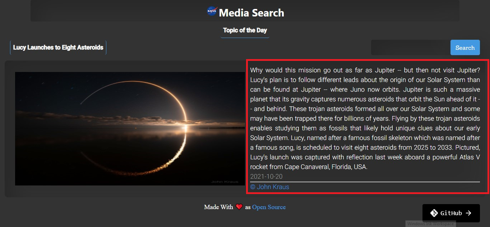
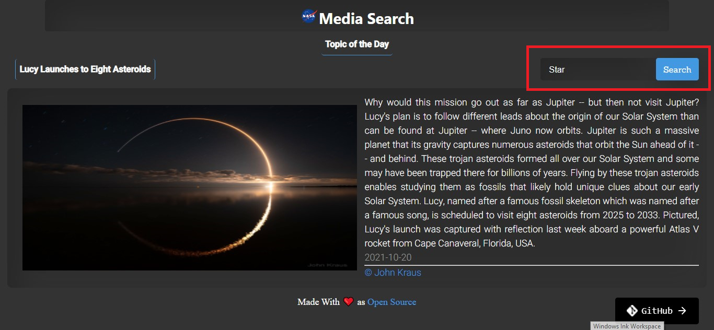
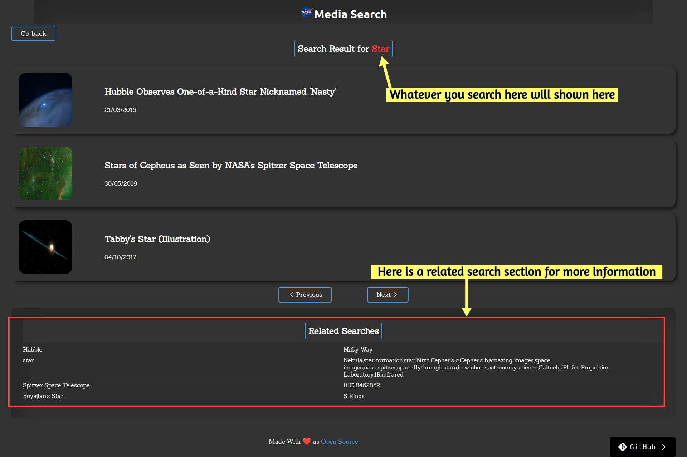
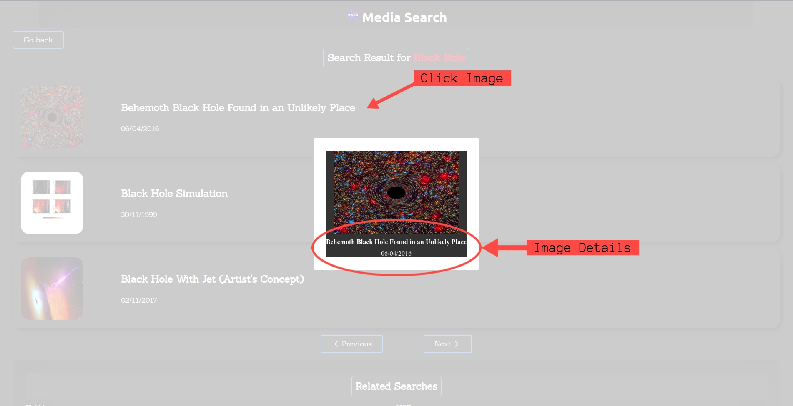
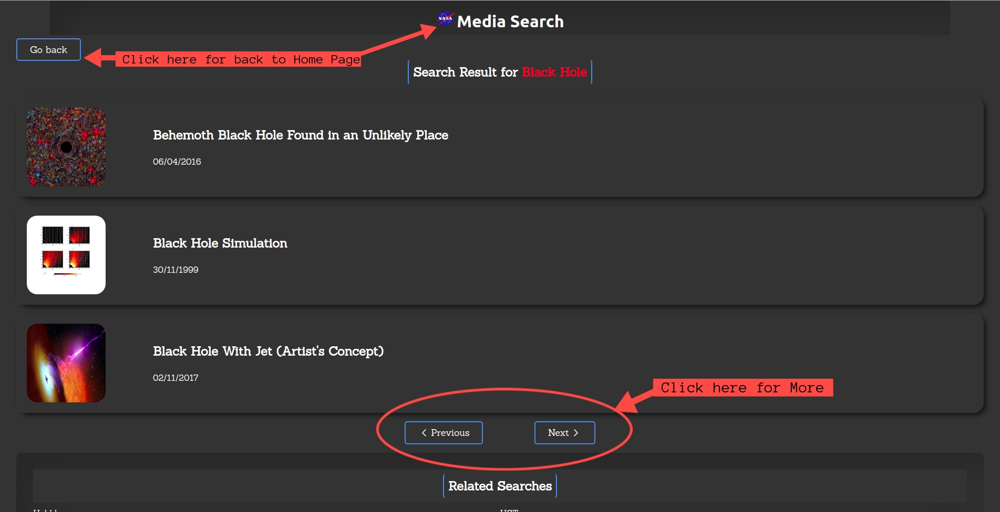

# NASA-Media-Search
> ReactJs | Jest | React-Testing-Library <br/>
[NASA-Media-Search](https://nasa-media-searchs.netlify.app/)

NASA Media Search is a beginner-friendly project in ReactJs, Jest, and react-testing-library. This project teaches you how to build a practical frontend with the help of beautiful APIs you already have.

## About

 A website provides a satellite's perspective of the planet as it looks today and as it has in the past through daily satellite images
 you just go and search of the image you want to see when it was clicked by NASA and how it looks, The image with it's detail shown there 

 Each day a different image or photograph of our fascinating universe is featured along with a brief explanation written by a professional astronomer data available on [NASA Picture of the Day](https://nasapicture.com/)
(current date through June 16, 1995).


```Enjoy searching and grap imformation hope you all love it.```


## Screenshots


### **Home Page**



### **Searching**


 
### **Search page**



### **Open image**



### **More search and back to home page**



## How to contribute to this project | Getting started
* Fork this repository (Click the Fork button in the top right of this page, click your Profile Image)
* Clone your fork down to your local machine

```markdown
git clone https://github.com/<YOUR-GITHUB-USERNAME>/NASA-Media-Search
```

* Create a branch

```markdown
git checkout -b branch-name
```

* Make your changes

* Commit and push

```markdown
git add .
git commit -m 'Commit message'
git push origin branch-name
```

* Create a new pull request from your forked repository (Click the `New Pull Request` button located at the top of your repo)
* Wait for your PR review and merge approval!
* __Star this repository__ if you had fun!

  
## API Reference

### APOD
One of the most popular websites at NASA is the [Astronomy Picture of the Day](https://apod.nasa.gov/apod/astropix.html).
In fact, this website is one of the most popular websites across all federal agencies. It has the popular appeal of a Justin Bieber video. 
This endpoint structures the APOD imagery and associated metadata so that it can be repurposed for other applications. In addition, if the concept_tags parameter is set to True, then keywords derived from the image explanation are returned. 
These keywords could be used as auto-generated hashtags for twitter or instagram feeds; but generally help with discoverability of relevant imagery.


The full documentation for this API can be found in the [APOD API Github repository](https://github.com/nasa/apod-api).

```http
HTTP Request

GET https://api.nasa.gov/planetary/apod
```
### Parameters


| Parameter | Type     | Type   | Description                |
| :-------- | :------- | :----- | :------------------------- |
| `date` | `YYYY-MM-DD` | `today` |`The date of the APOD image to retrieve` |

### Example query

https://api.nasa.gov/planetary/apod?api_key=DEMO_KEY
